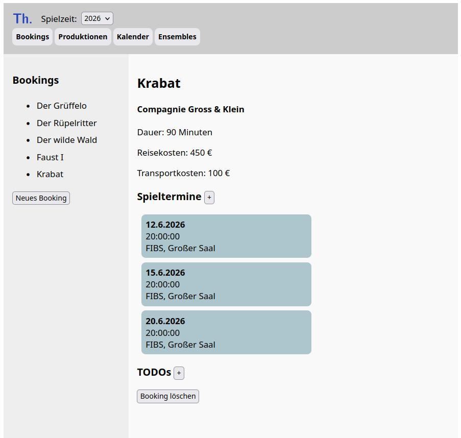

## Thema (working title)

A theatre management software, designed for flexibility and ease of use.
The App is currently under development.
Realized so far:

- Database Layout
- Backend
- Booking Section and ability to add new booking

### Planned features:

- The App should serve as a centralized registry for ensembles, artists, productions and venues
- Theatres can plan their seasons, festivals etc. by booking productions
- a calendar view offers convenient drag and drop planning
- extensive constraint checking (artist/staff availability, room sizes, stage set-up time, etc.)
- customizable attributes and views (e.g. cost overview)
- login function with user roles

The app uses a Django Backend and a React Frontend.
